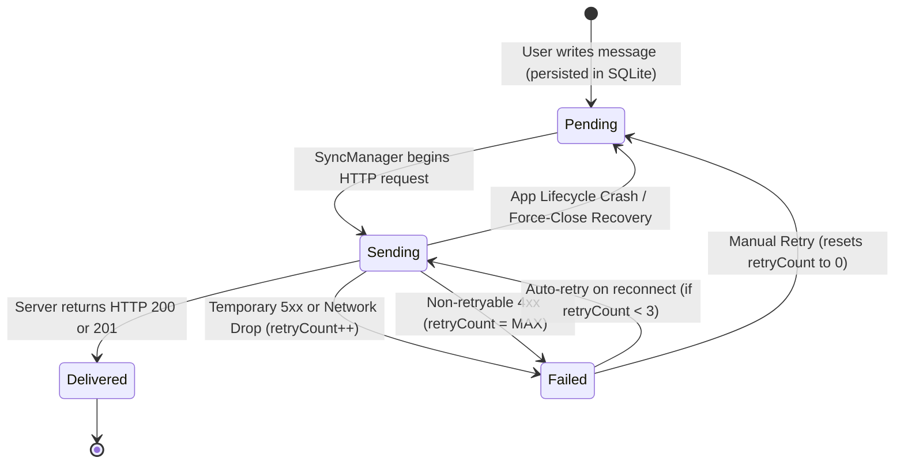

# SafeTrack: Offline-Capable Mobile Conversation Architecture & Decision Log

## Overview
This document details the architectural design, trade-offs, state machines, and recovery mechanics implemented for **Problem 2: Offline-Capable Mobile Conversation**.

The system ensures that a conversational companion never loses user messages during offline situations, network transitions, application backgrounding, or process force-closes. Furthermore, it guarantees exact message ordering, bounded retries, and strict idempotency under uncertain acknowledgements.

---

## 1. Outbox Ownership & Layered Architecture

The application enforces a clean separation of concerns across four distinct architectural layers:

```
┌─────────────────────────────────────────────────────────────┐
│  Presentation Layer: ConversationScreen.js                  │
│  - Optimistic UI updates                                    │
│  - Visible delivery state badges (pending, sending, etc.)   │
│  - Interactive Reviewer Simulation Controls & Manual Retry  │
└──────────────────────────────┬──────────────────────────────┘
                               │ Writes before transmission
┌──────────────────────────────▼──────────────────────────────┐
│  Durable Local Outbox Layer: messageRepository.js (SQLite)  │
│  - Single source of truth for durability across restarts    │
│  - Schema: clientMessageId, conversationId, content,        │
│    createdAt, deliveryState, retryCount, lastError          │
└──────────────────────────────▲──────────────────────────────┘
                               │ Reads FIFO queue / Updates state
┌──────────────────────────────┴──────────────────────────────┐
│  Synchronization Layer: SyncManager.js                      │
│  - NetInfo network lifecycle listener                       │
│  - Concurrency mutex & while-loop queue drainer             │
│  - Bounded retry policy (MAX_AUTO_RETRIES = 3)              │
│  - Crash recovery supervisor (resets sending -> pending)    │
└──────────────────────────────┬──────────────────────────────┘
                               │ HTTP POST with clientMessageId
┌──────────────────────────────▼──────────────────────────────┐
│  Backend API & Database Layer (Express / MongoDB)           │
│  - Idempotency key enforcement via unique clientMessageId   │
│  - Handles duplicate key error (11000) -> returns HTTP 200  │
└─────────────────────────────────────────────────────────────┘
```

- **Which layer owns the durable outbox?**
  The **persistence layer** (`src/database/messageRepository.js` backed by SQLite via `react-native-sqlite-storage`) owns the durable outbox. The React UI layer never acts as the source of truth for message transmission state; it renders directly from SQLite queries and reacts to `DeviceEventEmitter` notifications.

---

## 2. Allowed Delivery-State Transitions

The message lifecycle is governed by an explicit finite state machine:



### State Definitions & Valid Transitions
| State | Allowed Next States | Trigger / Condition |
| :--- | :--- | :--- |
| `pending` | `sending` | Network is online; SyncManager claims the message for transmission. |
| `sending` | `delivered` | Backend acknowledges receipt with HTTP 201 (Created) or HTTP 200 (Idempotent hit). |
| `sending` | `failed` | Network drop, timeout, or HTTP 5xx error occurs; `retryCount` is incremented. |
| `sending` | `pending` | **Lifecycle Crash Recovery**: App is terminated before ack arrives; restored to `pending` on restart. |
| `failed` | `sending` | Automatic retry triggered upon network reconnection (only when `retryCount < MAX_AUTO_RETRIES`). |
| `failed` | `pending` | Manual retry triggered by the user via the "Retry" button; resets `retryCount = 0` and `lastError = null`. |
| `delivered` | *(Terminal)* | Immutable state. Message is safely stored on the server. |

---

## 3. Ordering Policy & Product Trade-offs

### Documented Policy
Messages within a conversation are queued and synchronized in **Strict FIFO (First-In, First-Out)** order based on `createdAt ASC, id ASC`.

### Product Trade-offs
- **Causal Consistency (Benefit)**: In safety-critical contexts (e.g. factory reporting), message order is paramount. For example:
  1. *"Machine #4 pressure nominal"*
  2. *"Warning: Machine #4 pressure spiked, shut down"*
  Sending message #2 before message #1 would convey an inaccurate and dangerous operational state. Strict FIFO ensures causal order is never inverted.
- **Head-of-Line (HoL) Blocking (Trade-off)**: If an early message encounters a temporary failure, later messages in the queue are paused until the temporary failure is resolved.

---

## 4. Connectivity Triggers & Network Reconciliation

- **How connectivity changes trigger sync**:
  `SyncManager` subscribes to `@react-native-community/netinfo`.
  When a transition from offline to online (`wasOffline && isNowOnline`) is detected:
  1. `SyncManager.syncPendingMessages()` is invoked automatically.
  2. The worker checks for any messages in `pending` state or in `failed` state with `retryCount < MAX_AUTO_RETRIES`.
  3. Messages are dispatched sequentially.

- **Environment-Aware Endpoint Resolution (`__DEV__`)**:
  Mobile applications behave differently across development and release environments:
  * **Debug Builds (`__DEV__ === true`)**: Communicates with `http://localhost:5000` mapped over USB loopback using `adb reverse tcp:5000 tcp:5000`.
  * **Release APK Builds (`__DEV__ === false`)**: Physical devices running standalone APKs cannot use `localhost` because `localhost` maps to the phone's internal loopback (`127.0.0.1`), where no backend runs. `src/config.js` automatically selects `PROD_API_URL`, supporting:
    - **Local Wi-Fi Testing**: PC's local IP address (e.g. `http://10.102.115.9:5000`) over the same Wi-Fi.
    - **HTTPS Tunneling**: Free live tunnels via `npx localtunnel --port 5000` or `ngrok http 5000` (allowing real phone testing anywhere on Wi-Fi or mobile data).
    - **Cloud Deployment**: Production endpoints hosted on Render, Railway, or AWS.
  * **Cleartext Permitted**: Android Manifest includes `android:usesCleartextTraffic="true"` to ensure HTTP communication succeeds during local LAN testing.

---

## 5. Failure Classification & Retry Boundaries

Failures are divided into two distinct categories:

1. **Temporary Failures (Automatically Retried)**:
   - Network drop, DNS lookup failure, TCP connection reset, or HTTP timeout.
   - HTTP 5xx (500 Internal Server Error, 502 Bad Gateway, 503 Service Unavailable, 504 Gateway Timeout).
   - HTTP 429 (Too Many Requests / Rate Limited).
   - **Policy**: Automatically retried upon reconnection up to `MAX_AUTO_RETRIES = 3`.

2. **Permanent / Non-Retryable Failures (Not Auto-Retried)**:
   - HTTP 4xx client errors (e.g. 400 Bad Request, missing required fields, payload validation error).
   - Once a message encounters a 4xx error or exhausts 3 automatic retries, it transitions to a terminal `failed` state.
   - It remains visible in the conversation with an explicit red failure badge and an explanation of the error.
   - **Manual Recovery**: The user can tap the **"Retry"** button on the failed message bubble, which resets `retryCount = 0` and dispatches the message.

---

## 6. Idempotency Enforcement & Uncertain Acknowledgements (AC5)

Mobile networks are inherently unreliable: an outgoing message can reach the server and be written to disk, yet the acknowledgement packet may never reach the client due to a cellular drop or tunnel.

### Idempotency Mechanism:
1. **Client-Generated Stable Identifier**: Every message is assigned a UUID `clientMessageId` at the moment of local creation (e.g. `msg_8f12a4b8-...`).
2. **Database Unique Index**: The MongoDB `Message` collection defines a strict unique index:
   ```javascript
   clientMessageId: { type: String, required: true, unique: true }
   ```
3. **Idempotent Controller Logic**:
   When the client retries a request because the original acknowledgement was lost:
   - MongoDB detects the duplicate key and throws error code `11000`.
   - The backend catches error `11000`, finds the existing record using `clientMessageId`, and responds with **HTTP 200 OK** containing the existing document:
     ```javascript
     if (error.code === 11000 || (error.keyPattern && error.keyPattern.clientMessageId)) {
       const existingMessage = await Message.findOne({ clientMessageId: req.body.clientMessageId });
       return res.status(200).json(existingMessage);
     }
     ```
4. **Client Reconciliation**: The mobile client treats both HTTP 201 (new) and HTTP 200 (existing) as success, marking the local message as `delivered`. **Result: Exactly one logical message exists on the backend.**

---

## 7. Concurrency Control & In-Flight Additions (Stretch Work)

- **UI & Sync Mutual Exclusion**:
  `SyncManager` uses an internal boolean mutex flag `isSyncing`. If a user sends a message while sync is already active, `saveMessageLocal` saves the new message to SQLite with state `pending`.
- **Draining While-Loop**:
  Instead of synchronizing a static snapshot, `SyncManager` utilizes a loop:
  ```javascript
  while (this.isOnline && !this.simulateOffline) {
    const messages = await getPendingMessages();
    const messagesToSync = messages.filter(...);
    if (messagesToSync.length === 0) break;
    for (const msg of messagesToSync) {
      await send(msg);
    }
  }
  ```
  If new messages are queued while previous messages are in-flight, the loop continues and synchronizes the newly added messages in FIFO sequence before concluding.

---

## 8. Background Synchronization in Production

In this prototype, synchronization occurs while the application is in the foreground or active in the background. For a production deployment:
1. **Android (WorkManager)**:
   - Register a `CoroutineWorker` or `PeriodicWorkRequest` with network constraints (`NetworkType.CONNECTED`).
   - Triggered when network connectivity returns even if the app process has been killed by the OS.
2. **iOS (BGAppRefreshTask & URLSession Background Transfers)**:
   - Register background task identifier in `Info.plist`.
   - Use `NSURLSessionConfiguration.backgroundSessionConfiguration` for outbox upload tasks that continue transmitting even when the app is suspended.
3. **Push-Triggered Sync (Silent Remote Notifications)**:
   - Send silent VoIP/data APNs/FCM notifications to wake the mobile app and trigger pending outbox synchronization.

---

## 9. Follow-Up Discussion: Mitigating Head-of-Line Blocking

### Question:
*How would you change the ordering policy if one permanently failing message must not block later messages forever?*

### Solution Strategy:
1. **Per-Thread / Per-Conversation Partitioning**:
   - Rather than a single global queue, maintain independent FIFO queues partitioned by `conversationId`. A failure in Room A does not impede Room B.
2. **Causal Dependency Graphs**:
   - Add a `dependsOnMessageId` field to messages. If message #3 is independent of message #2, it can bypass message #2 upon failure.
3. **Queue "Bypass on Terminal Failure" Policy**:
   - Once a message reaches `MAX_AUTO_RETRIES = 3`, its delivery state transitions to `failed (unblocked)`.
   - The queue worker skips the failed message and proceeds to synchronize subsequent pending messages.
   - The failed message displays a persistent banner allowing the user to either:
     - **Retry**: Re-insert into the queue.
     - **Discard**: Delete from the local outbox.
     - **Edit**: Correct any invalid content and resend.

---

## 10. Reviewer Guide: How to Simulate All Scenarios

Reviewers can verify all scenarios either through the **interactive UI simulation controls** or the **automated verification benchmark**.

### Method A: Repeatable Command (Automated Benchmark)
Run the repeatable benchmark script with one command:
```bash
cd d:\reactnative\Caygnus\Frontend\SafeTrack
npm run benchmark
```

This automated sequence:
1. Queues 10 messages offline.
2. Simulates app termination and crash recovery.
3. Simulates temporary 503 error on message #3 and lost acknowledgement on message #7.
4. Restores connectivity and reconciles all messages.
5. Verifies backend has exactly 10 messages in FIFO order with 0 duplicates.

### Method B: Interactive UI Simulation (Mobile App)
1. Open the app and navigate to **Safety Conversation**.
2. Tap the **Sliders Icon** (top right) to expand the **Reviewer Simulation Panel**.
3. **Simulate Offline Send**:
   - Toggle **"Simulate Offline"** ON.
   - Type a message and tap **Send**.
   - Notice the amber badge `🕒 Pending` immediately displayed. The message is stored in SQLite.
4. **Simulate Crash & Durability**:
   - Force close the app or reload.
   - Re-open Conversation: the pending messages remain intact.
5. **Simulate Temporary Failure**:
   - Toggle **"Simulate 503 Temp Error"** ON.
   - Toggle **"Simulate Offline"** OFF.
   - The message turns red `⚠️ Failed (Attempt 1/3)`.
   - Toggle 503 OFF and tap **"Retry"**: the message reconciles to `✓ Delivered`.
6. **Simulate Lost Acknowledgement**:
   - Toggle **"Simulate Lost Ack"** ON.
   - Send a message: backend saves the message, but drops the response.
   - Tap **"Retry"**: backend recognizes duplicate key and returns HTTP 200 without creating a second record.
